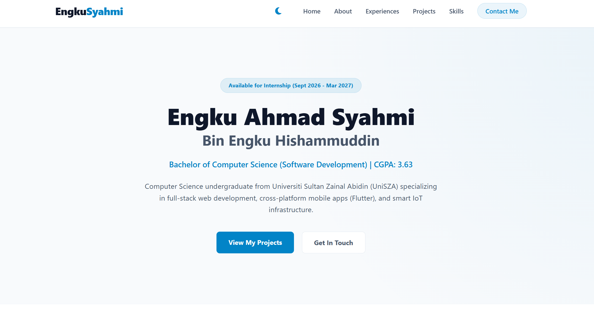
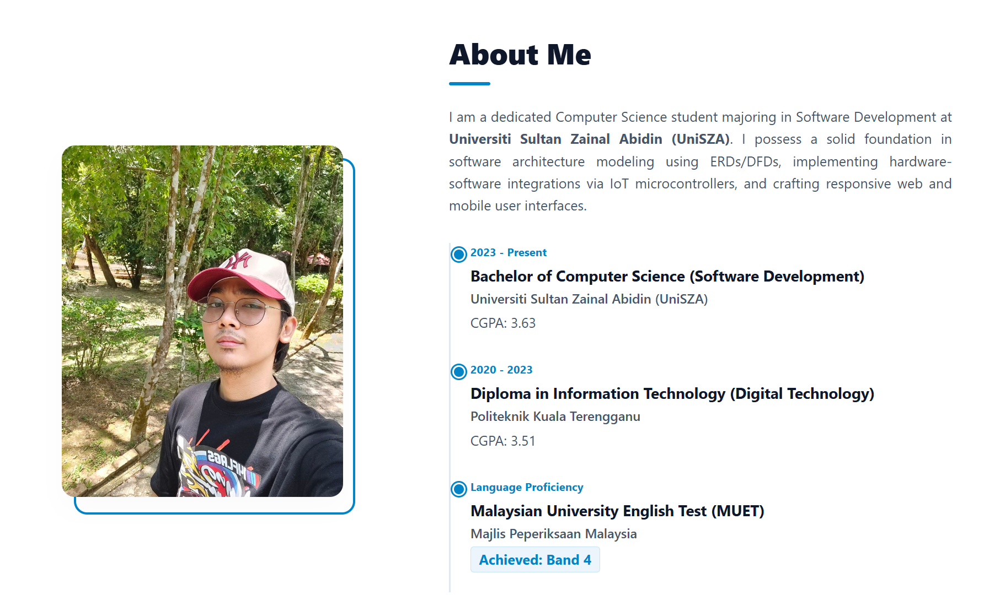
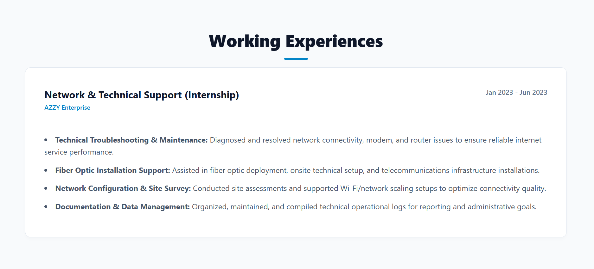
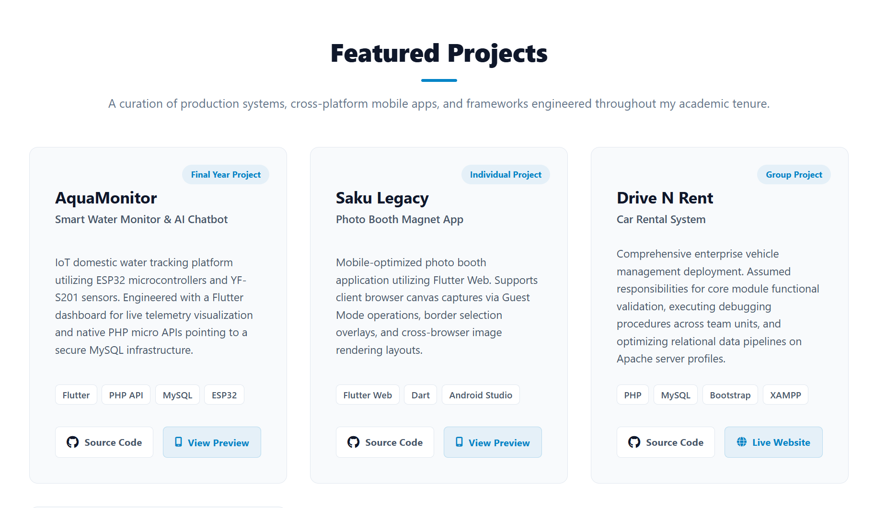
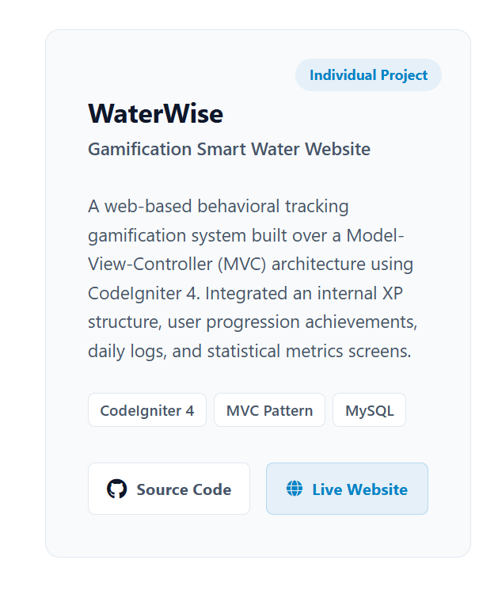
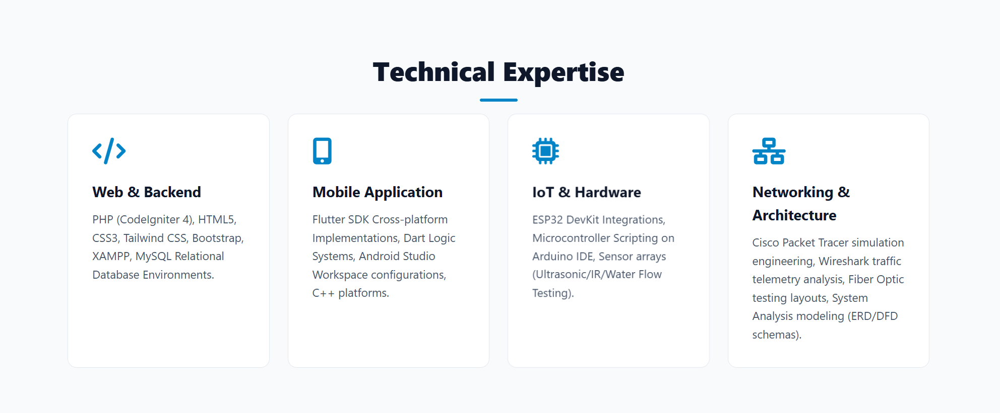
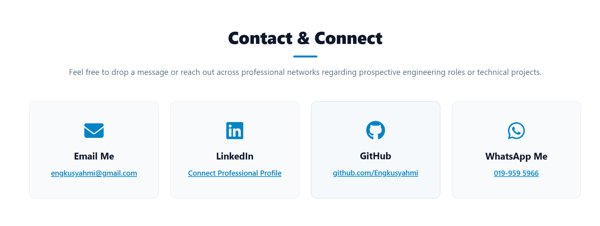

# Personal Software Engineering Portfolio and DevBlog
**Course Module:** CSD 34203 Special Topics in Software Development  
**Institution:** Universiti Sultan Zainal Abidin (UniSZA)  
**Developer:** Engku Ahmad Syahmi Bin Engku Hishammuddin (CGPA: 3.63)  
**Live Portfolio Website:** [https://engkusyahmi.com](https://engkusyahmi.com)

---

## 1. Project Overview
This repository functions as my comprehensive software engineering portfolio engineered as a high-performance Single Page Application (SPA). It showcases production-ready systems, cross-platform mobile apps, and IoT frameworks developed throughout my academic tenure at UniSZA. 

Instead of a generic placeholder, this repository serves as a live project hub featuring advanced client-side architecture, native UI components, an asynchronous multi-image modal preview system, and direct linkage to internal project module pathways.

### Portfolio Interface Previews

#### Home Section


#### About Section


#### Working Experiences Section



---

## 2. Core Featured Projects

### Project 1: AquaMonitor - Smart Water Monitor System
* **Role:** Final Year Project (Individual Core Developer)
* **Subfolder Path:** [portfolio/Project-Aquamonitor](https://github.com/Engkusyahmi/portfolio/tree/main/Project-Aquamonitor)
* **Tech Stack:** Flutter SDK (Dart), Native PHP (RESTful Micro-APIs), Hosted MySQL, ESP32 DevKit V1, YF-S201 Water Flow Sensor.
* **Key Engineering Features:**
    * **IoT System Telemetry:** Engineered end-to-end data pipeline streaming live water consumption logs from YF-S201 physical hardware sensors to cloud storage via ESP32 microcontrollers.
    * **Interactive Mobile Dashboard:** Designed a full-scale cross-platform mobile app tracking real-time metrics, system stats, and daily usage logs.
    * **AI Chatbot Integration:** Embedded an intelligent, context-aware AI chatbot inside the application to handle usage analytics queries and predictive consumption insights.
    * **Architectural Modeling:** Documented logic layers using structured Data Flow Diagrams (DFD Level 0 & Level 1) and Crow's Foot Notation Entity-Relationship Diagrams (ERD).

### Project 2: WaterWise - Gamification Smart Water Website
* **Role:** Individual Project Developer
* **Live Demo:** [WaterWise Live System](https://078730.unisza.work/GamingSmartWaterConsumption/)
* **Subfolder Path:** [portfolio/Project-Waterwise](https://github.com/Engkusyahmi/portfolio/tree/main/Project-Waterwise)
* **Tech Stack:** CodeIgniter 4 (PHP), MVC Architecture, MySQL Database, Tailwind CSS, Bootstrap.
* **Key Engineering Features:**
    * **Gamified Behavioral Tracking:** Developed a behavioral mechanics engine leveraging a custom internal XP system, user tier progression, and streak milestone rewards to promote water preservation.
    * **Robust MVC Pattern:** Deployed on CodeIgniter 4 utilizing clean separation of concerns, secure data models, and dynamic reporting controllers.

### Project 3: Saku Legacy - Photo Booth Magnet App
* **Role:** Individual Project Developer
* **Subfolder Path:** [portfolio/Project-SakuLegacy](https://github.com/Engkusyahmi/portfolio/tree/main/Project-SakuLegacy)
* **Tech Stack:** Flutter Web, Dart Core, ToyyibPay Gateway Integration, Android Studio.
* **Key Engineering Features:**
    * **Frictionless Client Routing:** Deployed a QR-code responsive layout permitting instant browser canvas photo captures under Guest Mode operations without native app installations.
    * **FinTech Transaction Pipeline:** Implemented secure hook integrations with the ToyyibPay payment gateway to process digital web payments prior to high-resolution asset rendering.

### Project 4: Drive N Rent - Car Rental System
* **Role:** Lead System Architecture & Backend Developer
* **Live Demo:** [Drive N Rent Live System](https://drivenrent.unisza.work/Main/)
* **Subfolder Path:** [portfolio/Project-DriveNRent](https://github.com/Engkusyahmi/portfolio/tree/main/Project-DriveNRent)
* **Tech Stack:** Native PHP, MySQL Database, Apache Server Setup, Bootstrap 5, XAMPP.
* **Key Engineering Features:**
    * **Enterprise Resource Management:** Formulated structural relational database schemas to drive a fully operational vehicle management dashboard.
    * **Optimization & Debugging:** Executed strict data validation routines, scrubbed relational query deadlocks, and optimized query pipelines on Apache server profiles.

#### Project Showcase Previews



---

## 3. Technical Expertise & Contact Infrastructure

### Technical Skills Preview


### Contact Hub Preview


---

## 4. Organized Repository Structure
Adhering to clean production standards and mapped directly from the local development workspace environment, the repository layout is structured as follows:

```text
portfolio/
│
├── .git/                    # Git repository configuration tracking
├── css/                     # Production styling layouts
│   └── style.css            # Custom layout engine with theme token variables
│
├── images/                  # Static media assets and user graphics
│   ├── Profile.jpg          # Developer professional profile image
│   ├── Home.png             # UI Screenshot: Home Section
│   ├── About.png            # UI Screenshot: About Section
│   ├── We.png               # UI Screenshot: Experience Section
│   ├── Project.png          # UI Screenshot: Projects Grid Page 1
│   ├── Project2.png         # UI Screenshot: Projects Grid Page 2
│   ├── Skill.png            # UI Screenshot: Technical Skills Section
│   ├── Contact.png          # UI Screenshot: Contact Details Section
│   └── 1.png to 14.png      # Sequential asset frames for AquaMonitor multi-slide modal
│
├── js/                      # Interactive scripts for portfolio customization
│   └── script.js
│
├── CNAME                    # Custom domain routing configuration for GitHub Pages
├── index.html               # Main Single Page Application (SPA) and Dynamic Portfolio Hub
├── README.md                # Technical documentation and repository map
│
├── Project-Aquamonitor/     # Full Local Source Code: Flutter Mobile App and PHP API Backend
├── Project-SakuLegacy/      # Full Local Source Code: Flutter Web Infrastructure
├── Project-DriveNRent/      # Full Local Source Code: Relational Car Rental Architecture
└── Project-Waterwise/       # Full Local Source Code: CodeIgniter 4 Web Application